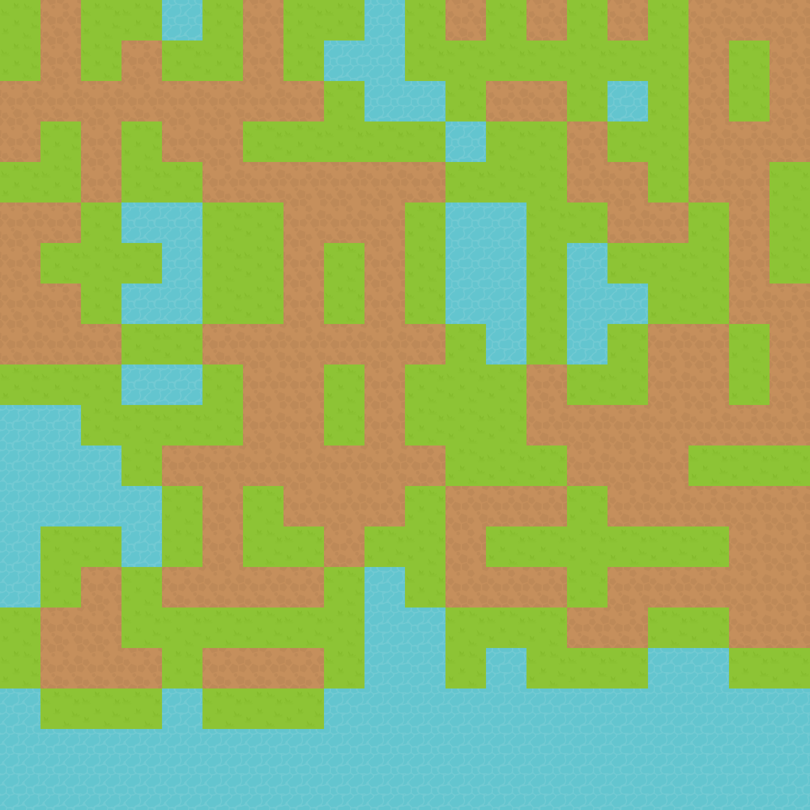
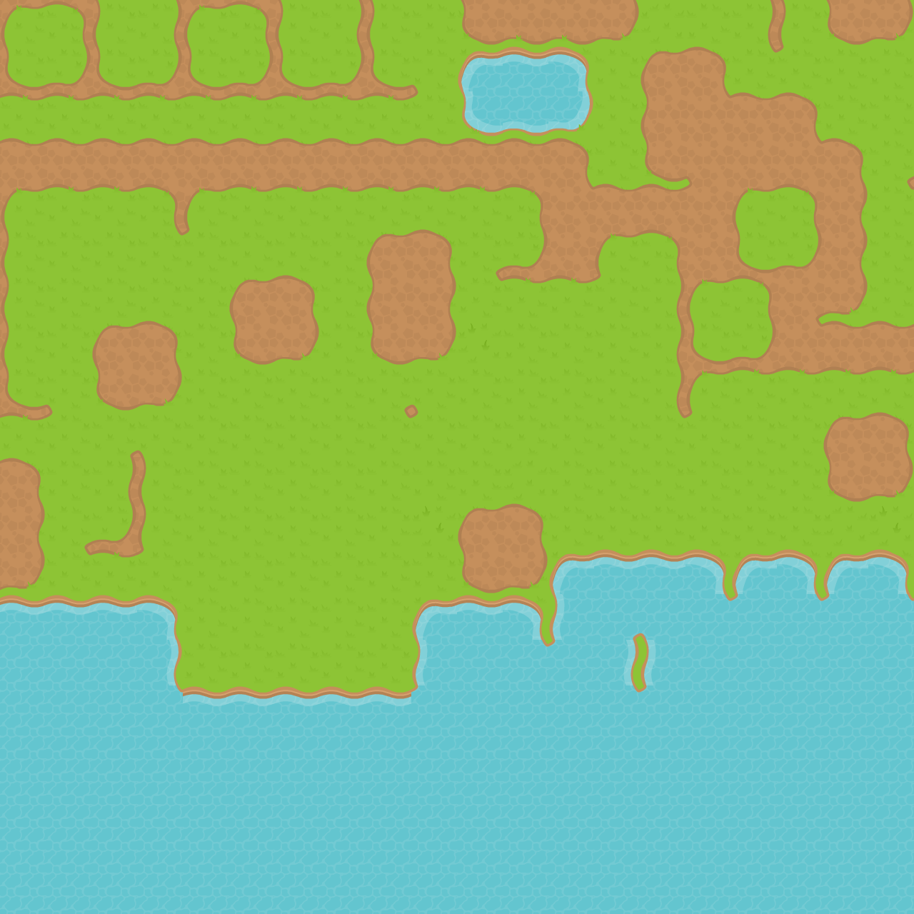

# Using Constraints to Generate Content That Follows Rules

 

A lot of procedural content generation (PCG) processes produce content that is interesting, but hard to control. For example, if you're generating a randomized level for a game, you might want to enforce that the exit is reachable from the entrance, or that there's a certain amount of treasure on the map (no more, no less). Most PCG systems that enforce these rules do so either by generating content and then checking if it follows the rules and regenerating a new level if it doesn't, or by carefully constructing algorithms that produce rule-following content by default.

But there's another way! Constraint programming is a general technique for solving problems subject to a variety of restrictions. The idea is that you describe a problem to a solver in terms of variables and constraints, and then the solver does some magic and hands you back a solution which meets all the constraints. At first, level generation might not seem like "solving a problem"-a level isn't an equation, after all-but solvers are quite flexible and they can be convinced to produce random solutions to problems, which looks a lot like procedural generation.

## What is Constraint Programming?
Constraint programming, or CP, is a general name for a family of algorithms that conduct searches over very large spaces (you can imagine the space of all possible levels in your game is probably quite large). The algorithms involved are pretty tricky and intricate-on par in complexity with a physics engine or a compiler-but fortunately, you don't need to know the details of how the solver works to use it, and there are lots of really good engines available for free.

Using a constraint solver usually involves three steps:

1. First, you describe to the solver what you'd like it to do.
2. Then, you invoke the "solve" procedure, which is where the engine does its magic.
3. Finally, assuming you described a problem which has a solution and the solver was able to find it, you extract the solution from the solver and interpret it into a useful piece of content (say, a game level).

Describing problems to constraint solvers means describing them in terms of _variables_ (usually _integer_ variables), and _constraints_. Each variable has a _domain_, which is the range of values it could potentially take on. For example, you might describe a tile-based map by having one variable for each tile in the map, and assign each _kind_ of tile a unique integer.

```
TERRAIN = ['mountain', 'water', 'plains']
tiles = []
for (let y = 0; y < height; y++)
  for (let x = 0; x < width; x++)
    tiles[y * width + x] = model.intVar(0, TERRAIN.length - 1)
```

If you gave this model to a solver with its default search configuration, it would probably set every tile to mountains and call it a day. That wouldn't be a terribly interesting content generator, though! There are two more ingredients we need to add to get an interesting generator: _constraints_, and _search randomization_.

Constraints define how the different parts of the model interact. For instance, if you want to assert that mountains can never be adjacent to water, you could add a constraint between each pair of variables representing adjacent tiles that if one of them is mountain, the other cannot be water.

```
for (each adjacent pair of tile variables left, right) {
  // 0 = mountain, 1 = water
  model.forbidAssignment([left, right], [0, 1])
  model.forbidAssignment([left, right], [1, 0])
}
// similarly for vertically adjacent pairs
```

Different solvers have different available constraint types, but all of them share at least a common baseline: boolean operations like _and_, _not_, _implies_, cardinality constraints like _count_, integer expressions like addition and subtraction, and several others. Usually there will be several possible ways of describing a particular concept to a solver, some of which will be more efficient to solve than others. It's good to experiment.

Finally, the default search parameters for most solvers are tuned to find _any_ solution as fast as possible. For generating content, we'd actually prefer it find a _random_ solution. There are two ways of going about this: randomized search, and randomized solution hints.

Normally, the constraint solver picks the next decision to make based on complex internal heuristics about what it thinks will get it to a solution the fastest. Randomizing the search means instructing the solver to make random decisions, at least some of the time. Most solvers have a randomized search strategy available that you can enable. The other option is to give a randomized "hint" to the solver, setting the initial state of the variables to random values that doesn't necessarily obey all the constraints. The solver will use the hint as a starting point for its search.

If you want to check out some fully-functioning code samples, I've made a
couple you can check out on GitHub:
https://github.com/nornagon/constraint-solving-pcg

## Running the examples

```
python3 -mvenv env
source env/bin/activate
pip install -r requirements.txt
python example-hinting.py
# look at out.png
```
